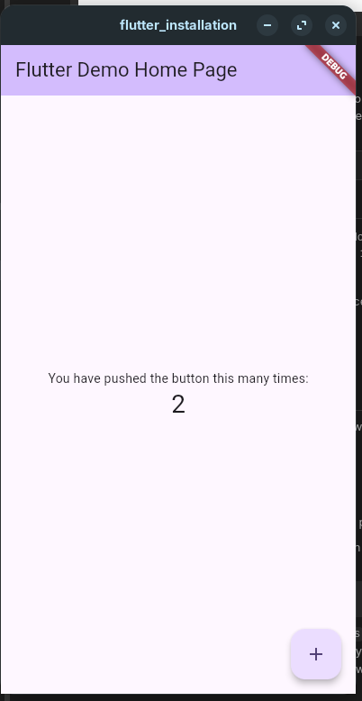

# Task: Flutter Installation

## 1. Download and Install Flutter SDK
- ✅ Flutter SDK installed (v3.41.6, stable channel)

## 2. Set Up an IDE
- Android Studio **or** VS Code
- Install required plugins:
  - Flutter
  - Dart

## 3. Set Up a Device
- Android Emulator **or**
- Physical Android device (USB debugging enabled)

## 4. Verify Setup
```bash
flutter doctor
```
- ✅ No issues found

## 5. Create a Sample Flutter Project
```bash
flutter create flutter_installation
```
- ✅ Project created

## 6. Run the App
```bash
flutter run
```
- ✅ App running successfully

## Screenshots

<!-- Add your screenshots here -->


